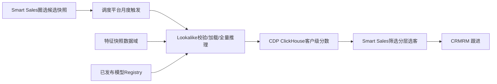
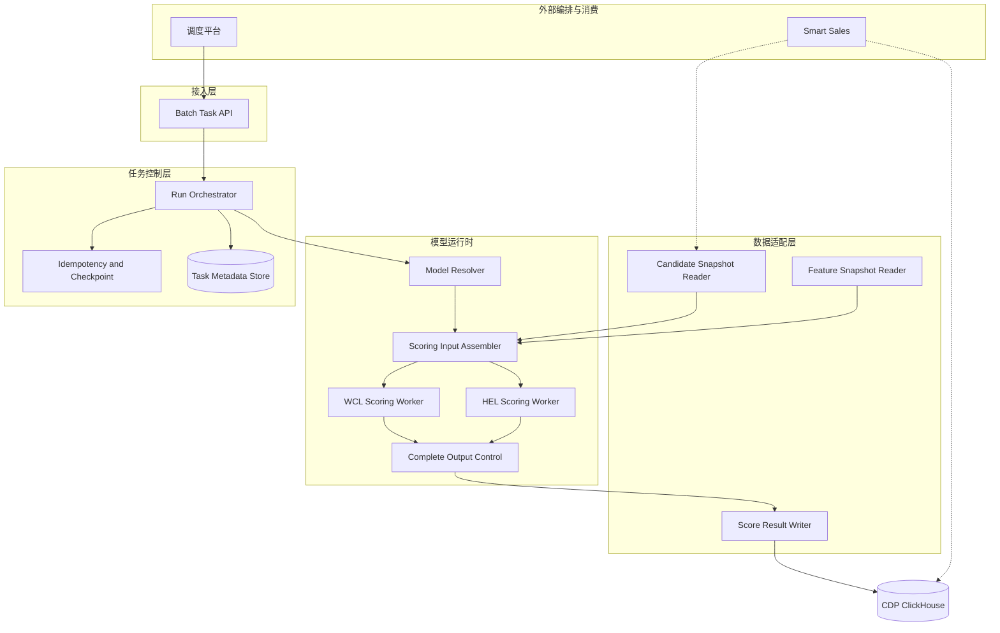
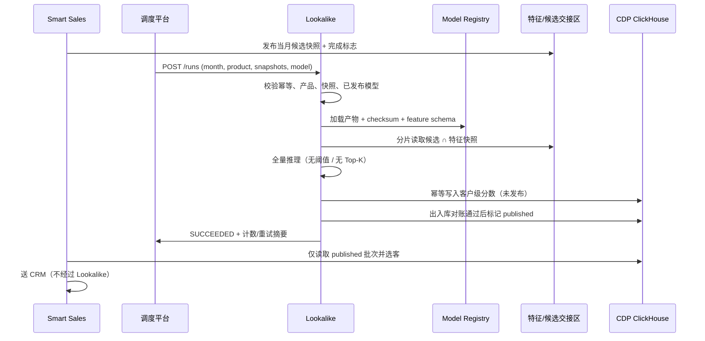
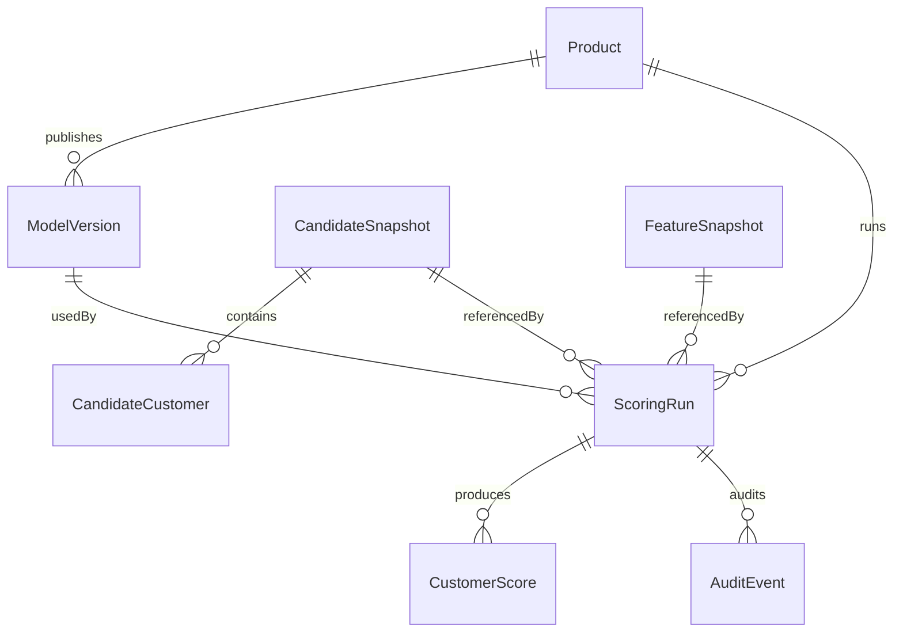

# Lookalike 月度批处理打分服务 — 详细设计说明书 v4.0

> 无前端 · 预生产训练 / 生产仅推理 · 月度候选池全量打分 · 结果写入 Sales CDP ClickHouse

| 项 | 内容 |
| --- | --- |
| 版本 | 4.0 |
| 日期 | 2026-08-17 |
| 对齐 SAD | MB Bank Lookalike V1.0 |
| 产品范围 | 白领贷 / 房屋易贷 |
| 状态 | 草案 · 待架构与干系人评审 |

## 目录

- 1. 文档概述与客户变更
- 2. 相对 v2.1 / v4 草案的优化清单
- 3. 系统边界与确认架构决策
- 4. 逻辑架构与模块职责
- 5. 月度批处理主流程
- 6. 调度平台任务 API
- 7. 推理运行时（Worker / 分片 / 幂等）
- 8. Sales CDP 结果 schema 与写入
- 9. 数据模型
- 10. 模型产物加载与预生产训练边界
- 11. 特征对齐、泄漏防护与冷启动
- 12. 安全、审计与隐私
- 13. 非功能、容量与可观测性
- 14. 测试设计
- 15. 仓库落地映射与废弃能力
- 16. 待确认项、风险与演进

## 1. 文档概述与客户变更

> **确认：** 本文档是 **SAD V1.0** 的实现级详细设计（SAD REF-05）。客户已确认：**取消 Lookalike 前端**；模型在预生产建好并发布后，**每月定时对当月合格候选客群做全量打分**；打分结果按附件 schema **同步到 Sales CDP**。此前的**文件上传**与**基于 Segment 打分**不再需要。

### 1.1 目的

给出生产 Lookalike 作为**无前端的月度批处理推理服务**的实现依据：任务接入、候选/特征读取、已发布模型加载、全量推理、幂等写入 CDP、状态与审计。训练、EDA、IV 筛选、审批发布属于预生产，不进入生产运行时。

### 1.2 「全量打分」口径（客户用语对齐）

> **注意：** 客户所说「每月对全量客户打分」在本设计中定义为：对 **Smart Sales 按产品资格、活跃、黑名单与合规规则圈选并冻结的当月候选快照中的全部有效客户**打分，推理过程**不设阈值、不做 Top-K 截断**。筛选、分层、名单生成由 Smart Sales 在读取 CDP 分数后完成。这**不是**对全行客户主数据（SAD 参考约 3572 万）打分。

### 1.3 术语

| 术语 | 含义 |
| --- | --- |
| 候选池 / Candidate Snapshot | Smart Sales 按产品资格生成的冻结客户集合；生产推理的唯一打分总体 |
| 特征快照 / Feature Snapshot | 与已发布模型 schema 对齐、以 T0 为截止的客户特征集 |
| 批处理运行 / Scoring Run | 某产品 + 某评分月 + 某候选快照 + 某模型版本的一次受控推理 |
| run_batch_id | Lookalike process ID；一次运行的唯一标识，对应 CDP 复合键左侧 |
| Profile ID | CDP 客户档案主键；逻辑上对应 customer_id，与 HostCif / personal_cif 的物理映射待确认 |
| Lookalike score | 正类概率 similarity_score，区间 [0, 1] |
| Sales CDP | 分数落库与治理归属；物理存储为 CDP 所属 ClickHouse |
| Seed | 仅预生产训练正样本；生产不接收种子上传，不圈选种子 |

### 1.4 参考

| 文件 | 角色 |
| --- | --- |
| MB Bank System Architecture Document_Lookalike V1.0 | 系统边界、逻辑/数据/集成架构、容量与 NFR 的 Source of Truth |
| Sales CDP 字段表（客户附件） | 写入 CDP 的业务字段：复合键、Profile ID、分数、模型 ID/名称、product ID |
| BRD v2.4 / BAD v3.2 | 业务目标、双产品、评估与验收 |
| Capacity Planning v2.3 | 单产品 3.0M / 4.5M / 6.0M、约 50 特征、4 小时窗口的性能测试基线 |
| 本仓库 src/lookalike/ | 可复用：LightGBM 推理、Feature Adapter、泄漏 denylist、缺失/截断预处理 |
| v2.1 详细设计 / DESIGN_PLAN.md | 历史方案；被本文档在生产边界上取代 |

## 2. 相对 v2.1 / v4 草案的优化清单

v2.1 仍按「交互式 Process + 上传/Segment + 前端 Dashboard」设计。客户讨论后的 v4 草案已改为批处理，但与 SAD 仍有多处冲突。本版按 SAD 校正，并固化 CDP 附件 schema。

### 2.1 明确取消的能力

| 原能力（v2.1 / 当前仓库） | 处置 | 原因 |
| --- | --- | --- |
| React / 业务前端 8 屏 | 取消 | 客户确认取消 Lookalike 前端；SAD AD-01 |
| 种子/候选 CSV 上传 | 取消 | 生产不接收用户文件；候选由 Smart Sales 快照提供 |
| 基于 Segment 打分 | 取消 | 客户确认不再需要；资格圈选上收 Smart Sales |
| Create Process / Generate / Version Dashboard | 取消 | 无业务用户会话；运行由调度平台发起 |
| 阈值 / Top-K / 导出拆分 | 移出 Lookalike | 筛选与名单在 Smart Sales；Lookalike 只产出全量分数 |
| Lookalike 直连 CRM | 取消 | SAD AD-08：Smart Sales 选客后送 CRM |
| 生产环境训练 / 自动抽种子 / 自动重训切流 | 取消 | SAD AD-03：生产只加载已审批发布模型 |

### 2.2 相对 v4 草案的架构校正

| # | v4 草案问题 | 本版优化 |
| --- | --- | --- |
| 1 | 对特征表「全部客户」打分（示例 5000 万） | 只打 Smart Sales 当月候选快照；容量基线 3.0M–6.0M / 产品 |
| 2 | 进程内 APScheduler 作为主调度 | 调度平台月度触发；Lookalike 提供任务接入与状态查询 |
| 3 | 生产内 PSI>0.25 自动重训并 Canary | PSI 只监控告警；重训/发布走模型治理，生产不训练 |
| 4 | CDP 默认同步 REST / SFTP / Kafka | 主路径：幂等写入 CDP ClickHouse；发布后再供 Smart Sales 消费 |
| 5 | CDP 字段缺复合主键 | 按附件增加 Lookalike Model ID x Profile ID = process ID 拼接 Profile ID |
| 6 | JWT 业务用户 + 结果查询/Dashboard API | 系统间身份；仅任务、状态、健康检查、受控重跑 |
| 7 | API 进程内 ThreadPool 打分 | 任务服务与 Scoring Worker 分离；按产品/分片水平扩展 |
| 8 | 产品代码 SFU 与 SAD 不一致 | 白领贷 White-Collar Loan、房屋易贷 Home Easy Loan；product_code 待确认 |
| 9 | 目录仍含 result.py / dashboard.py / 导出 CSV | 生产镜像不包含业务查询 UI 与文件导出 |
| 10 | 生产抽种子 SQL / 规则编译器入模泄漏 | 种子仅预生产；沿用仓库 leakage.py 硬失败，不把圈选列当特征 |

### 2.3 仍保留并复用的仓库能力

- **LightGBM**：生产推理主模型
- **Adapter**：特征 schema 对齐
- **denylist**：泄漏字段硬失败
- **IV / P99**：仅预生产冻结进产物

## 3. 系统边界与确认架构决策

### 3.1 定位

Lookalike 从 Smart Sales 内嵌模块独立为**后端批处理推理服务**。它不拥有客户、产品、候选池或 CRM 主数据；分数仅用于营销排序，**不替代**资格判定、反欺诈、授信审批、定价、押品估值或放款决策。

### 3.2 已确认决策（摘自 SAD）

| ID | 决策 |
| --- | --- |
| AD-01 | 无前端的后端批处理服务，与 Smart Sales 分离 |
| AD-02 | 一期仅白领贷、房屋易贷，模型独立，不做跨产品融合模型 |
| AD-03 | 银行提供种子；训练/验证/发布在预生产完成；生产只推理 |
| AD-04 | Smart Sales 计算并提供符合资格的候选池 |
| AD-05 | 调度平台按月发起产品级批处理 |
| AD-06 | 对全部有效候选打分，推理阶段无阈值 / Top-K |
| AD-07 | 完整结果写入 CDP ClickHouse，按评分月与 run batch 隔离 |
| AD-08 | Smart Sales 选客后送 CRM；Lookalike 不调用 CRM |
| AD-09 | CRM 承载 RM 跟进；反馈字段与 KPI 归因待确认 |

### 3.3 端到端业务闭环（Lookalike 只负责 3–6）



## 4. 逻辑架构与模块职责



### 4.1 生产部署单元

| 单元 | 职责 | 技术基线 |
| --- | --- | --- |
| Batch Task Service | 任务接入、校验、状态、受控取消/重跑；无 UI | Python 3.12 + FastAPI + Uvicorn |
| Scoring Worker | 特征变换、模型加载、分片推理、checkpoint | 同运行时；按产品隔离；4 vCPU / 16 GiB 为性能测试单元 |
| Task Metadata Store | 运行状态、幂等键、checkpoint、重试关系 | 技术组件待确认；禁止仅存进程内存 |
| Model Cache | 已发布产物只读缓存 | 按产品+版本隔离；checksum 校验 |
| CDP ClickHouse | 客户级分数存储与查询 | CDP 负责集群、权限、分区、TTL |

### 4.2 生产镜像禁止项

生产镜像只包含任务接入、批推理、数据访问与可观测性依赖。matplotlib / seaborn / SHAP / Optuna / 训练与报表依赖默认留在预生产。不打包前端工程、文件上传处理、Segment 解析、业务 Dashboard。

### 4.3 依赖方向

```
api/          → orchestrator, auth, schemas
orchestrator/ → metadata, workers, adapters
workers/      → model_runtime, feature_align, leakage_validate
adapters/     → candidate reader, feature reader, cdp writer
model_runtime → artifact repo (read-only)
禁止反向依赖。生产代码路径不得 import 训练 / EDA / 上传模块。
```

## 5. 月度批处理主流程



### 5.1 步骤与责任

| 步 | 责任方 | 处理 | 输出 |
| --- | --- | --- | --- |
| 1 | Smart Sales | 按白领贷/房屋易贷资格、活跃、排除名单、合规规则圈选 | 产品级候选快照 |
| 2 | 调度平台 | 校验上游依赖并发起产品级运行 | run_batch_id、评分月、产品、快照引用 |
| 3 | Lookalike | 校验请求、幂等键、快照、已发布模型 | 可执行运行记录 |
| 4 | Lookalike / 数据提供方 | 分批读取有效候选及模型所需特征 | 对齐后的打分输入 |
| 5 | Lookalike | 加载对应产品已发布模型，对全部有效候选推理 | 客户级完整分数 |
| 6 | Lookalike / CDP | 写入分数与追溯字段；对账后发布 | 按月/批次隔离的 CDP 表 |
| 7–8 | Smart Sales / CRM | 读分、选客、送名单、RM 跟进 | 目标名单与跟进记录 |

### 5.2 运行状态机

状态至少包括：`PENDING` → `VALIDATING` → `RUNNING` → `SUCCEEDED` / `FAILED`；瞬态错误进入 `RETRYING`（最多 3 次）；外部取消进入 `CANCELLED`。写 ClickHouse 期间内部细分为 `WRITING`（未发布）与对账成功后的 `PUBLISHED`（对调度平台仍映射为 `SUCCEEDED`）。

- 同一业务幂等键不得产生不受控的重复运行。
- 受控重跑必须使用**新** `run_batch_id`，并关联原批次；不得覆盖已发布历史。
- 对账失败不得将批次标记为可被 Smart Sales 消费。
- 进程重启后根据 checkpoint 从已提交分片续跑，或安全失败等待受控重跑。

## 6. 调度平台任务 API

> **说明：** Lookalike **没有**业务用户 API。以下接口仅供调度平台与运维身份调用。协议、认证、时区、回调方式待确认（SAD P-01），下列为详细设计建议契约。

### 6.1 约定

| 项 | 约定 |
| --- | --- |
| Base path | /api/v1/lookalike |
| 认证 | 系统间身份（mTLS / 平台颁发的服务凭证）；不提供页面登录 |
| 字段 | JSON camelCase；元数据存储 snake_case |
| 幂等 | 请求头 Idempotency-Key 或 body idempotencyKey |
| 追踪 | 每个请求必须带 traceId |

### 6.2 端点清单

| # | 方法 | 路径 | 功能 |
| --- | --- | --- | --- |
| 1 | GET | /health | 存活/就绪（含元数据存储与 ClickHouse 探活摘要） |
| 2 | POST | /api/v1/lookalike/runs | 创建月度产品级打分运行 |
| 3 | GET | /api/v1/lookalike/runs/{runBatchId} | 查询状态、计数、错误、重试 |
| 4 | POST | /api/v1/lookalike/runs/{runBatchId}/cancel | 受控取消 |
| 5 | POST | /api/v1/lookalike/runs/{runBatchId}/rerun | 受控重跑（新批次，关联原批次） |

~~不再提供：`/eda`、`/features/analyze`、`/model/train`、`/lookalike/score`、`/processes`、`/candidates/upload`、`/generate`、`/dashboard`、结果导出、Segment 打分。~~

### 6.3 创建运行

`POST /api/v1/lookalike/runs`

```
{
  "runBatchId": "WCL-202608-0001",
  "scoringMonth": "2026-08",
  "productCode": "WCL",
  "candidateSnapshotId": "SNAP-WCL-202608-01",
  "featureSnapshotId": "FEAT-202608-T0",
  "modelVersion": "wcl-lgb-3.2.0",
  "triggerTime": "2026-08-01T02:00:00+07:00",
  "traceId": "tr-8f3a...",
  "idempotencyKey": "WCL|2026-08|SNAP-WCL-202608-01|wcl-lgb-3.2.0"
}
```

`modelVersion` 可省略：此时解析该产品当前已审批且已发布的生效版本。响应返回 `state`、`resolvedModelId`、`resolvedModelVersion`。

### 6.4 状态查询（调度回调用）

```
{
  "runBatchId": "WCL-202608-0001",
  "state": "RUNNING",
  "productCode": "WCL",
  "modelId": "M-WCL-LGB",
  "modelVersion": "wcl-lgb-3.2.0",
  "candidateCount": 4500000,
  "validInputCount": 4488120,
  "scoredCount": 2100400,
  "writtenCount": 2100400,
  "published": false,
  "retryCount": 0,
  "checkpoint": { "shardId": "14", "offset": 50000 },
  "errorCode": null,
  "traceId": "tr-8f3a..."
}
```

### 6.5 错误码

| code | 含义 | 是否自动重试 |
| --- | --- | --- |
| 0 | 成功 | — |
| 1001 | 参数缺失/非法 | 否 |
| 2001 | 调用方身份无效 | 否 |
| 2002 | 无权调用该接口 | 否 |
| 3002 | 同一幂等键运行冲突 | 否（返回已有运行） |
| 4002 | 候选快照未就绪或不匹配 | 否（等依赖） |
| 4003 | 特征快照/schema 不匹配 | 否 |
| 5003 | 模型未审批或未发布 | 否 |
| 5004 | 产物 checksum/签名失败 | 否 |
| 5101 | 瞬态读/写超时 | 是（≤3） |
| 5102 | 出入库对账失败 | 否（不发布） |
| 9999 | 未分类内部错误 | 按错误类型 |

## 7. 推理运行时（Worker / 分片 / 幂等）

### 7.1 Worker 步骤

1. **解析模型**：按产品 + 版本从 Registry 拉取已审批发布产物（模型 + 预处理 + feature_list 顺序 + 填补/截断阈值 + schema 版本），校验 checksum/签名。
2. **冻结输入**：运行开始后候选快照、特征快照、模型版本不可变。
3. **组装输入**：候选 ID 与特征快照按统一客户标识 JOIN；校验必填、缺失策略、schema；记录 valid / invalid。
4. **泄漏校验**：对入模列执行 denylist；命中则失败，禁止降级继续。
5. **分片推理**：默认 50,000 行/片；`predict_proba` 正类概率即为 Lookalike score；clip 到 [0, 1]。
6. **完整输出**：每个有效候选都必须有分；不按分数过滤。
7. **分片提交**：写入 CDP 暂存区或按 Replacing/去重键幂等写入；更新 checkpoint。
8. **对账发布**：candidateCount、validInputCount、scoredCount、writtenCount 一致（允许已文档化的 invalid 差）后置 `published=true`。

### 7.2 不在推理中做的事

- 不训练、不重算 IV、不动态重选特征。
- 不应用 similarity threshold，不截 Top-K，不生成营销 Segment。
- 不排除「种子客户」——生产打分总体是候选快照，不是「全池减种子」。
- 冷启动：若已发布模型规定 Observation Window 内无行为客户为 invalid，则计入 `invalidInputCount` 并写原因码，不静默丢分。

### 7.3 幂等与重跑

| 场景 | 行为 |
| --- | --- |
| 调度重复投递同一幂等键 | 返回已有 runBatchId，不新建 |
| Worker 崩溃后重启 | 从最近成功 checkpoint 续跑已提交分片之外的数据 |
| 受控 rerun | 新 runBatchId，rerunOf 指向原批次；原 published 行保留 |
| ClickHouse 短暂不可用 | 停止加压；退避重试 ≤3；超限 FAILED 并告警 |

### 7.4 产品隔离

白领贷与房屋易贷使用独立模型、特征定义、批次与结果标识。Lite 容量基线默认**串行**跑两个产品；若需并行，须重算 Worker 配额。路由按 `productCode` 进入对应 Worker 池。

## 8. Sales CDP 结果 schema 与写入

> **确认：** 客户附件定义了同步到 Sales CDP 的**业务字段**。物理表名、分区表达式、排序键、去重引擎、TTL 由 CDP 确认（SAD P-04）。Lookalike 是生产者，CDP 负责存储治理。

### 8.1 业务字段（客户附件，必须落地）

| 业务字段名 | 建议物理列 | 类型 | 来源 | 说明 |
| --- | --- | --- | --- | --- |
| Lookalike Model ID x Profile ID | lookalike_key | String | 拼接 | 复合唯一标识：Lookalike process ID（run_batch_id）与 Profile ID 拼接 |
| Profile ID | profile_id | String | 候选快照客户主键 | 客户在 CDP 的档案 ID |
| Lookalike score | lookalike_score | Decimal(8,4) | 模型 predict_proba | 该 process 返回的相似度分，[0, 1] |
| Model ID | model_id | String | 已发布模型元数据 | 模型标识 |
| Lookalike model | lookalike_model | String | 已发布模型元数据 | 模型名称 |
| product ID | product_id | String | 运行请求 productCode | 该次 Lookalike 使用的产品 |

### 8.2 复合键构造

```
lookalike_key = "{run_batch_id}x{profile_id}"
# 示例
# run_batch_id = WCL-202608-0001
# profile_id   = 000123456789
# lookalike_key = WCL-202608-0001x000123456789
```

> **注意：** 附件字段名是「Model ID x Profile ID」，说明文字是「process ID joined with Profile ID」。本设计以**说明文字为准**：左侧必须是 `run_batch_id`（process/run），不能只用 `model_id`。同一模型每月对同一客户会再次打分；用 model×profile 会跨月冲突并破坏 SAD「按评分月与 run batch 隔离、重跑不覆盖已发布历史」的要求。

### 8.3 追溯扩展列（SAD 最低要求，对 Smart Sales/审计）

下列列**不替代**附件六字段，而是同一张结果表上的技术追溯列，便于对账与血缘：

| 列 | 说明 |
| --- | --- |
| run_batch_id | 与复合键左侧一致，便于按批查询 |
| scoring_month | YYYY-MM |
| model_version | 已发布版本 |
| feature_snapshot_id / candidate_snapshot_id | 输入冻结引用 |
| scored_at / trace_id | 打分时间与追踪 |
| publish_status | staging / published / superseded |
| rerun_of | 受控重跑时指向原 run_batch_id |

逻辑唯一键建议：`product_id + run_batch_id + profile_id + model_version`。ClickHouse 主键/ORDER BY/去重引擎待 CDP 详细设计确认。结果中**不得**包含证件号、完整账号、明文特征宽表。

### 8.4 写入与发布

1. 按 `CDP_BATCH_SIZE`（建议 5,000）批量 INSERT；同一 `lookalike_key` 幂等。
2. 写入时 `publish_status=staging`；Smart Sales 查询必须过滤 `published`。
3. 全批对账成功后原子更新（或写发布标志表）为 `published`。
4. 对账失败：保持 staging，状态 `FAILED` / `5102`，不向下游开放。
5. Lookalike **不**再通过 REST/SFTP/Kafka 推送业务名单；若 CDP 侧另有物化视图，由 CDP 治理，不在本服务实现三套同步模式。

### 8.5 Smart Sales 消费约定

- 只读 `publish_status='published'` 的批次。
- 阈值、分层、Top-N、排除已持仓等业务规则在 Smart Sales 执行。
- 向 CRM 发送目标名单不经过 Lookalike。

## 9. 数据模型



### 9.1 所有权

| 对象 | 责任域 | Lookalike 权限 |
| --- | --- | --- |
| 候选快照 | Smart Sales（物理位置待确认） | 只读 |
| 特征快照 | 数据域（待确认） | 只读 |
| 模型产物 | 模型治理 / Registry | 只读 |
| 运行元数据 / checkpoint | Lookalike | 读写 |
| 客户级分数 | CDP 存储治理；Lookalike 生产 | 授权写入 |
| 目标名单 / CRM 跟进 | Smart Sales / CRM | 无 |

### 9.2 运行元数据（逻辑表scoring_run）

| 列 | 说明 |
| --- | --- |
| run_batch_id | PK；即 CDP process ID |
| scoring_month / product_code | 运行维度 |
| candidate_snapshot_id / feature_snapshot_id | 冻结输入 |
| model_id / model_version / artifact_checksum | 已发布模型 |
| state / retry_count / rerun_of | 状态机 |
| candidate_count / valid_input_count / scored_count / written_count | 对账计数 |
| checkpoint_json | 分片进度 |
| idempotency_key | 唯一 |
| error_code / error_message / trace_id | 失败与追踪 |
| started_at / completed_at | 时间 |

Lookalike **不以**自建 MySQL `t_score_result` 作为 Smart Sales 的消费源。若 Worker 需要本地暂存，仅作失败恢复缓冲，TTL 短、不对外查询。

### 9.3 建议 ClickHouse 逻辑 DDL（名称待 CDP 确认）

```
CREATE TABLE lookalike_customer_score
(
    lookalike_key            String,
    profile_id               String,
    lookalike_score          Decimal(8, 4),
    model_id                 String,
    lookalike_model          String,
    product_id               String,
    run_batch_id             String,
    scoring_month            String,
    model_version            String,
    candidate_snapshot_id    String,
    feature_snapshot_id      String,
    scored_at                DateTime,
    trace_id                 String,
    publish_status           LowCardinality(String),
    rerun_of                 String
)
ENGINE = /* ReplacingMergeTree 或 CDP 指定去重引擎，待确认 */
PARTITION BY scoring_month
ORDER BY (product_id, run_batch_id, profile_id);
```

## 10. 模型产物加载与预生产训练边界

> **禁止：** 生产 Lookalike **不**构建样本、不选特征、不训练、不调参。只加载已审批发布的模型与预处理产物。

### 10.1 预生产（不在本服务生产路径）

1. 业务定义种子、标签、候选范围、T0、验收指标（白领贷 / 房屋易贷分别进行）。
2. 数据平台构建训练/验证/OOT，脱敏副本供分析。
3. EDA、IV、缺失/同值筛选、P99 截断、泄漏审计；比较算法后固化 Feature Spec 与 Model Recipe。
4. 受控环境训练 LightGBM（主）与可选 LR+WOE（解释基线）；OOT 与稳定性评估。
5. 治理审批：适用产品、版本、schema、checksum/签名、生效时间、回滚版本。

预生产质量门禁基线（最终以模型治理为准）：缺失率 >95% 剔除；同值率 >95% 剔除；IV <0.02 剔除；显著偏度按批准的 P99 截断；禁止 T0 之后才出现的结果/审批/放款/营销反馈字段。筛选与填补规则必须冻结进产物，生产只校验并执行，不重新筛选。

### 10.2 生产加载契约

```
PublishedArtifact
  model_id, model_name, product_code, model_version
  feature_schema_version
  feature_list[]          # 有序，打分列顺序必须一致
  preprocessor            # 填补值、P99 阈值、编码水平
  estimator               # LightGBM Booster / 兼容格式
  leakage_denylist[]
  checksum / signature
  approval_status == published
  effective_from / rollback_version
```

加载失败（未发布、产品不匹配、schema 不一致、checksum 失败）→ 任务 `FAILED` / `5003` 或 `5004`，不得用缓存旧版本静默顶替，除非调度请求显式指定回滚版本且该版本仍为 published。

### 10.3 PSI 与重训

上线后按月监控分数/特征 PSI；0.25 为当前参考基线，正式阈值待治理批准。PSI 超阈 → **告警工单**，不在生产自动训练、不自动切换流量。新版本经预生产训练、OOT、审批发布后，由下一次月度调度解析到新版本。

## 11. 特征对齐、泄漏防护与冷启动

复用本仓库已实现的 Adapter 与 denylist，扩展为生产 schema 校验，而不是在 Worker 里散落列名。

- `src/lookalike/adapters/`：原始/宽表 → 模型帧；生产使用与产物绑定的 Feature Spec。
- `src/lookalike/adapters/leakage.py`：`ResponsePropensity`、放款后字段、证件号、CIF 等命中即失败。
- `src/lookalike/preprocessing/missing_outliers.py`：仅执行产物内冻结规则。
- 候选资格字段若在快照内为常量，不得进入特征矩阵（避免「学会资格规则」）。

> **注意：** DESIGN_PLAN 评审 F-03：圈选规则列若进入特征，会出现 AUC≈1.0 且把已持仓客户排到最前。生产不再圈选种子；预生产必须把标签定义列并入 denylist，并保留 AUC>0.98 的泄漏告警。

客户主键逻辑名统一 `customer_id`；写入 CDP 时映射为 `profile_id`。与 `personal_cif` / `HostCif` 的正式映射待数据治理确认（SAD P-03）。

## 12. 安全、审计与隐私

- 无业务用户、无页面会话；调度平台、ClickHouse、Registry、运维平台使用**分离的最小权限系统身份**。
- 密钥不进代码、镜像或 `requirements.txt`；走银行批准的 Secret 机制。
- 传输使用批准的 TLS；静态加密由 CDP 与产物平台负责。
- 日志禁止记录证件号、完整账号、明文凭证、模型 Secret、不必要的特征值。
- 生产数据不得未授权复制到开发或外部；不得将真实客户数据提交公共大模型。
- 审计事件：触发、校验、模型加载、读写、状态变更、重试、失败；字段含 `run_batch_id`、`trace_id`、系统身份、结果、错误码。

## 13. 非功能、容量与可观测性

### 13.1 容量基线（v2.3 Lite，非正式生产配额）

| 场景 | 单产品候选 | Worker | 配额 |
| --- | --- | --- | --- |
| 低 | 3.0M | 2 × 4 vCPU / 16 GiB | 8 vCPU / 32 GiB |
| 期望 | 4.5M | 3 | 12 vCPU / 48 GiB |
| 高 | 6.0M | 4 | 16 vCPU / 64 GiB |

- 规划吞吐：500K 候选·模型 / 小时 / Worker（含读、组装、推理、回写），含 25% 余量。
- 单产品端到端窗口规划目标 ≤ 4 小时；正式 SLA 以 3.0M 与 6.0M 等价测试为准。
- 任务服务规划 2 vCPU / 4 GiB，只负责任务 API。
- 最终特征约 50 列（从约 100 候选特征压缩，且上游不再准备被删特征）。
- 存储逻辑估算（期望/高）：150 GB / 200 GB；分数约 0.25 KB/客户/模型/月，保留 12 个月——均待 CDP 确认。

> **注意：** 废弃 v4 草案「5000 万全池、进程内 10 线程、6–7 小时」作为生产口径。该数字与 SAD 候选规模和 Worker 分离部署均不一致。

### 13.2 可靠性目标

| 属性 | 目标 |
| --- | --- |
| 月度执行窗口可用性 | 参考 ≥ 99.5%（口径待运维确认） |
| 自动重试 | 仅瞬态错误，最多 3 次，退避+抖动 |
| 在途数据 | 已提交分片故障后不丢 |
| 安全 | 无高危；中危关闭 |

### 13.3 监控告警

| 域 | 指标 | 告警示例 |
| --- | --- | --- |
| 任务 | 排队、时长、状态、重试、成功率 | 月任务未启动、超时、反复重试 |
| 数据 | 候选数、有效数、缺失率、出入库差 | 候选异常、关键特征缺失、条数不一致 |
| 模型 | 版本、加载、分数分布、PSI | 未发布版本、加载失败、分布突变 |
| ClickHouse | 写入吞吐、失败率、分区大小 | 超时、拒绝、分区异常增长 |

结构化日志必须能按 `run_batch_id`、`product_code`、`model_version`、`trace_id` 检索。v4 草案承认的「无 JSON 日志 / 无 trace」在本版列为必须项，不再作为已知缺口遗留到上线。

## 14. 测试设计

| 层 | 重点 |
| --- | --- |
| 单测 | 复合键构造、幂等键、denylist 硬失败、预处理与训练一致性（列顺序/填补/P99）、状态机 |
| 契约测试 | 调度请求必填字段；CDP 六字段 + 追溯列；未发布批次不可被消费查询 |
| 集成 | 候选∩特征 JOIN、分片 checkpoint 续跑、对账失败不发布、rerun 新批次 |
| 性能门禁 | 3.0M 与 6.0M 端到端；记录 CPU/内存/读写/恢复时间/幂等 |
| 安全 | 依赖与镜像扫描、渗透；无高危 |

必须覆盖的负例：模型未发布、schema 多列/少列、denylist 残留、重复投递、候选未就绪、ClickHouse 写入部分失败、用 `model_id` 而非 `run_batch_id` 构造复合键。

仓库现有 `tests/test_adapters.py`、`tests/test_lookalike.py` 在生产改造期保留为预生产/回归；新增 `tests/test_cdp_schema.py`、`tests/test_run_orchestrator.py` 覆盖本章契约。交互式上传与 Segment 用例标记删除，不再作为验收。

## 15. 仓库落地映射与废弃能力

### 15.1 目标目录（生产）

```
src/lookalike/
  api/runs.py              # 调度任务 API
  orchestrator/            # 状态机、幂等、checkpoint
  workers/scoring.py       # 分片推理（替换 generate.py 的上传候选路径）
  adapters/                # 保留：schema 对齐 + leakage
  modeling/lightgbm_model.py  # 仅 predict
  preprocessing/           # 仅执行冻结规则
  integrations/cdp_clickhouse.py
  integrations/artifact_repo.py
  domain/run_store.py      # 运行元数据（替换 process_store 的业务 Process）
```

### 15.2 预生产保留（不进生产镜像）

`eda/`、`features/iv.py`、`pipeline/service.py` 中的 `train`、`scripts/full_process.py` 继续服务模型团队；通过独立 image/extra 安装。

### 15.3 当前仓库 API 的退役表

| 现端点 | v4.0 |
| --- | --- |
| POST /api/v1/eda | 退役（预生产脚本） |
| POST /api/v1/features/analyze | 退役 |
| POST /api/v1/model/train | 退役出生产 |
| POST /api/v1/lookalike/score | 退役 |
| GET /api/v1/dashboard | 退役 |
| POST /api/v1/processes 及 upload/generate/version | 退役；由 /runs 取代 |

实现顺序建议：先落地 Run API + Worker 读快照 + ClickHouse writer + denylist；再删除上传/Process 路径；最后收缩生产镜像依赖。在代码切换完成前，本文档是目标态，不以当前 FastAPI 上传实现为生产合同。

## 16. 待确认项、风险与演进

### 16.1 待确认（继承 SAD Appendix 6.3）

调度接口与时区（P-01）、候选交接位置（P-02）、客户主键映射（P-03）、ClickHouse 物理设计（P-04）、模型产物平台（P-05）、容量与 SLA 实测（P-06）、部署平台与 Python patch（P-07）、网络与 Secret（P-08）、监控（P-09）、备份容灾（P-10）、Smart Sales–CRM（P-11）、业务反馈归因（P-12）、治理阈值（P-13）。未确认项不得写成「已实现能力」。

### 16.2 主要风险

| ID | 风险 | 缓解 |
| --- | --- | --- |
| R-01 | 候选或特征快照未在窗口内就绪 | 调度依赖检查、就绪标志、受控重跑 |
| R-02 | 候选/特征/模型版本错配 | 冻结引用、schema 与 checksum 校验 |
| R-03 | 候选量超出 4 小时窗口 | 3.0M/6.0M 性能测试，校准分片与并行策略 |
| R-04 | 重试产生重复分 | 复合键幂等、发布标志、出入库对账 |
| R-05 | 未发布模型进入生产 | 审批状态 + 签名；禁止静默回退 |
| R-07 | 分布漂移 | 月度 PSI 告警；治理后发布新版本 |

### 16.3 验收基线（业务，非正式 SLA）

- 白领贷：Top 20% 名单响应率 ≥ 历史同类 1.2 倍（上线后 30 天 A/B 或等效对照）。
- 房屋易贷：Top 20% 合格线索率、申请转化率 ≥ 历史 1.2 倍。
- 两产品：AUC/KS 在验证/OOT 透明报告，不预设硬门禁；Lift@Top20% 参考 ≥ 1.2。

### 16.4 ADR（本版）

1. 生产形态 = 无前端批处理推理服务，不是交互式 Lookalike 平台。
2. 打分总体 = Smart Sales 候选快照全量有效客户，不是全行客户主数据，也不是用户上传/Segment。
3. CDP 主路径 = ClickHouse 幂等写入 + 对账后发布；附件六字段为业务合同。
4. 复合键左侧 = `run_batch_id`（process ID），不是单独的 `model_id`。
5. 训练与推理解耦；生产镜像无训练栈；PSI 不自动切流。
6. Lookalike 不直连 CRM；阈值与选客在 Smart Sales。
7. 分数只用于营销排序，不进入授信决策。

Lookalike 月度批处理打分服务 — 详细设计说明书 v4.0 · 对齐 SAD V1.0 与 Sales CDP 附件 schema · 2026-08-17
